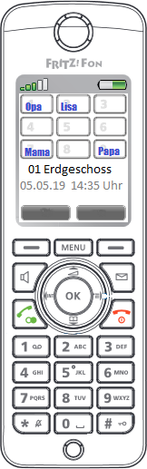

# CardDAV contacts import for AVM FRITZ!Box

## Features

  * download from any number of CardDAV servers
  * read from any local *.vcf files (optional)
  * selection (include/exclude) by categories or groups (e.g. iCloud)
  * upload of contact pictures to display them on the FRITZ!Fon (handling see below)
  * automatically preserves quickdial and vanity attributes of phone numbers set in FRITZ!Box Web GUI. These data are saved separately in the internal FRITZ!Box memory under `//fritz.nas/FRITZ/mediabox/Atrributes.csv` from loss.
  The legacy way of configuring your CardDav server with custom properties `X-FB-QUICKDIAL`/`X-FB-VANITY` is no longer supported
  * automatically preserves custom-made internal numbers (e.g. if you use [Gruppenruf](https://avm.de/service/fritzbox/fritzbox-7490/wissensdatenbank/publication/show/1148_Interne-Rufgruppe-in-FRITZ-Box-einrichten-Gruppenruf/))
  * if more than nine phone numbers are included, the contact will be divided into a corresponding number of phonebook entries (any existing email addresses are assigned to the first set [there is no quantity limit!])
  * phone numbers are sorted by type. The order of the conversion values (`phoneTypes`) determines the order in the phone book entry
  * the contact's UID of the CardDAV server is added to the phonebook entry. These values are self-evident not visible in the FRITZ!Box GUI, but kept in the phonebook when saving it locally
  * generates an image with keypad and designated quickdial numbers (2-9), which can be uploaded to designated handhelds (see details below)

## Requirements

  * PHP >7.1 (php7.1 php7.1-curl php7.1-mbstring php7.1-xml php7.1-gd)
  * Composer (follow the installation guide at https://getcomposer.org/download/)

## Installation

Install requirements

    git clone https://github.com/andig/carddav2fb.git
    cd carddav2fb
    composer install --no-dev

edit `config.example.php` and save as `config.php`

## Usage

### List all commands:

    ./carddav2fb list

### Complete processing:

    ./carddav2fb run

### Get help for a command:

    ./carddav2fb run -h

#### Preconditions

Please read these instructions carefully and set the FRITZ!Box settings accordingly

  * FRITZ!Box storage is activ [Heimnetz -> Speicher (NAS) -> Speicher (NAS) aktiv]
  * internal memory is indexed [Heimnetz -> Speicher (NAS) -> Speicher an der FRITZ!Box -> Interner Speicher]
  * memory (USB stick) is indexed [Heimnetz -> Speicher (NAS) -> Speicher an der FRITZ!Box -> USB-Speicher]
  * ftp access is active [Heimnetz -> Speicher (NAS) -> Heimnetzfreigabe -> Zugriff über FTP aktiv]
  * it is recommended to enable SMB access so you can easily delete/manipulate contact pictures and other stored files (e.g. `Attributes.csv`) as needed [Heimnetz -> Speicher (NAS) -> Heimnetzfreigabe -> Zugriff über ein Netzlaufwerk (SMB) aktiv]
  * you use a separate user (NOT `dslf-config`!) which has explicit permissions for FRITZ!Box settings, access to NAS content and read/write permission to all available memory [System -> FRITZ!Box-Benutzer -> [user] -> Berechtigungen]

### Upload FRITZ!Fon background image

Using the `background-image` command it is possible to upload the set quickdial numbers 2-9 as background image to FRITZ!Fon (nothing else!)

    ./carddav2fb background-image

Uploading can also be included in uploading phonebook:

    ./carddav2fb run -i

#### Preconditions

  * CardDAV Server provides contact images in JPEG or PNG format (otherwise please open an [issue](https://github.com/andig/carddav2fb/issues))
  * requires FRITZ!Fon C4 (or newer) handhelds
  * settings in FRITZ!Fon: [Einstellungen -> Anzeige -> Startbildschirme -> Klassisch -> Optionen -> Hintergrundbild]
  * assignment is made via the internal number(s) of the handheld(s) in the `fritzfons` array in config.php
  * internal number have to be between `610` and `615`, no `**` prefix is needed

## Debugging

For debugging please set your config.php to

    'http' => 'debug' => true

## Docker image

The Docker image contains the tool and all its dependencies. A volume
`/data` contains the configuration files. If the configuration is
missing, the Docker entrypoint will abort with an error message and copy
an example file to the volume.

There are two ways to use the image:

    docker run --rm -v ./carddav2fb-config:/data andig/carddav2fb command...

will execute a single command (and remove the created container
afterwards).

Without a command, the container entrypoint will enter an endless loop,
repeatedly executing `carddav2fb run` in given intervals. This allows
automatic, regular updates of your FRITZ!Box's phonebook.

## License
This script is released under Public Domain, some parts under GNU AGPL or MIT license. Make sure you understand which parts are which.

## Authors
Copyright (c) 2012-2019 Andreas Götz, Volker Püschel, Karl Glatz, Christian Putzke, Martin Rost, Jens Maus, Johannes Freiburger
